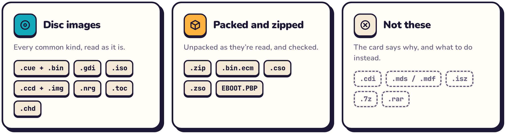

<p align="center">
  <picture>
    <source media="(max-width: 600px) and (prefers-color-scheme: dark)" srcset="docs/brand/hero-mobile-dark.png">
    <source media="(max-width: 600px)" srcset="docs/brand/hero-mobile-light.png">
    <source media="(prefers-color-scheme: dark)" srcset="docs/brand/hero-dark.png">
    
  </picture>
</p>

<p align="center">
  <a href="https://github.com/PowerBeef/discpress/releases/latest/download/discpress.html">
    <picture>
      <source media="(prefers-color-scheme: dark)" srcset="docs/brand/download-dark.png">
      
    </picture>
  </a>
  <a href="https://powerbeef.github.io/discpress/">
    <picture>
      <source media="(prefers-color-scheme: dark)" srcset="docs/brand/open-dark.png">
      
    </picture>
  </a>
</p>

<p align="center">
  <a href="https://github.com/PowerBeef/discpress/releases/latest"></a>
  <a href="https://github.com/PowerBeef/discpress/actions/workflows/ci.yml"></a>
  <a href="LICENSE"></a>
  <br><br>
  <b>Free and open source</b> &nbsp;·&nbsp; <b>No install</b> &nbsp;·&nbsp; <b>Nothing uploaded</b> &nbsp;·&nbsp; <b>Phone and desktop</b>
  <br><br>
  <a href="#how-it-works">How it works</a> &nbsp;·&nbsp;
  <a href="#features">Features</a> &nbsp;·&nbsp;
  <a href="#systems-and-files">Systems and files</a> &nbsp;·&nbsp;
  <a href="#ready-for-your-emulator">Your emulator</a> &nbsp;·&nbsp;
  <a href="#get-started">Get started</a> &nbsp;·&nbsp;
  <a href="#faq">FAQ</a> &nbsp;·&nbsp;
  <a href="#build-it-yourself">Build it yourself</a>
</p>

> [!TIP]
> **New in 1.7: Discpress knows your games better.** US Sega discs, second discs and regional releases get their right names; Jaguar CD, Video CD and more discs are recognized; and you are warned before you make a CHD your emulator can't play. [See what's new](https://github.com/PowerBeef/discpress/releases/latest).


## What is Discpress?

A single PlayStation or Saturn game can be a dozen `.bin` files plus a `.cue`. **CHD** packs the whole disc into one compressed file: much smaller, nothing lost, and loaded directly by MAME, RetroArch, DuckStation, PCSX2, PPSSPP, Flycast, MiSTer and more.

The standard tool for making CHDs is **chdman**, a command-line program from the MAME project. **Discpress** runs its own fork of chdman (MAME 0.289, faster, with its bugs fixed) in a friendly app in your browser, on your phone or your computer. It:

- makes **the very same CHD files** as chdman 0.289;
- **names each game** after its official title, from the Redump database;
- **checks your dumps** against Redump and your DAT files;
- **opens the files your games come in**: cue sheets, `.gdi`, `.iso`, `.zip`, ECM, CSO, `EBOOT.PBP` and more;
- **warns you** before you make a CHD your emulator can't play.

There is nothing to install, and your files never leave your device. **Download it** as one HTML file that works anywhere, even offline, or **use it online** with nothing to download (the way to convert big games on iPhone and iPad).

## How it works

<p align="center">
  <picture>
    <source media="(max-width: 600px) and (prefers-color-scheme: dark)" srcset="docs/brand/steps-mobile-dark.png">
    <source media="(max-width: 600px)" srcset="docs/brand/steps-mobile-light.png">
    <source media="(prefers-color-scheme: dark)" srcset="docs/brand/steps-dark.png">
    
  </picture>
</p>

<p align="center">
  <picture>
    <source media="(prefers-color-scheme: dark)" srcset="docs/brand/showcase-dark.png">
    
  </picture>
</p>

## Features

<p align="center">
  <picture>
    <source media="(max-width: 600px) and (prefers-color-scheme: dark)" srcset="docs/brand/features-mobile-dark.png">
    <source media="(max-width: 600px)" srcset="docs/brand/features-mobile-light.png">
    <source media="(prefers-color-scheme: dark)" srcset="docs/brand/features-dark.png">
    
  </picture>
</p>

<details>
<summary><b>Everything it can do</b></summary>
<br>

**Converting**

- **Real chdman output.** Standard CHD v5 files, byte for byte the same as desktop chdman 0.289 makes on Linux, with the same checksums as any chdman 0.289.
- **The right command, picked for you:** `createcd`, `createdvd`, `createhd`, `createld`, `extractcd`, `extractdvd`, `extracthd`, `verify` and `info`, with the type and hunk size each console's emulators need. The **Advanced** tab has every chdman command and option, including `copy`, parent CHDs, `addmeta` and hard disk templates.
- **Compression to suit you.** *Smallest* (the default) is chdman's own. *Nearly as small, faster* tries each track only with the codec that suits it: about 1.7 times as fast for CDs, at most 0.3% bigger, same checksums. *Faster to create*, *Faster to load (Zstd)*, *For MiSTer FPGA* and *No compression* are there too.
- **Fast.** Compression is spread over all your CPU cores, with WebAssembly SIMD when your browser supports it. Extracting and verifying use several cores too.
- **Back again.** A CHD extracts to its Redump dump: the same cue sheet and one `.bin` per track, so the files match Redump's checksums. Settings → *Keep the cue sheet in CD CHDs* also keeps what a CHD doesn't otherwise hold (CATALOG, FLAGS, ISRC, extra indexes), for discs that have it.

**Knowing your games**

- **Game recognition.** Discpress reads the disc's own boot files to find the console, the serial number, which disc of a set it is and its region. It then looks the game up in a built-in copy of the [Redump](http://redump.org) database (about 42,000 discs). When the size and CRC-32 match, the dump is marked as verified. When several releases still fit, you choose which one.
- **Official names.** For example `Metal Gear Solid (USA) (Disc 1).chd`. You can also type your own name, turn renaming off, or use **Rename** to fix the name of a CHD you already have.
- **Your DAT files.** Add Redump or No-Intro DAT files (the `.dat` or `.xml`, or the `.zip` they come in) and every track of a disc is checked against them by size and CRC-32: before converting, and for a CHD after **Verify**, without extracting it. A disc whose every track matches is named after its DAT entry. The DATs are kept in the browser for your next visits.
- **Verify** checks a CHD's own checksums, then compares it with Redump without extracting it.

**Reading what you have**

- **Archives and packed images are opened as they are read:** `.zip` archives (zip64 included), ECM images (`.bin.ecm`), CSO and ZSO compressed ISOs, and PlayStation `EBOOT.PBP` files made with popstation, one card per disc. Each is checked as it is unpacked.
- **Disc images of every common kind:** cue sheets and their tracks, Dreamcast `.gdi` sets, `.iso` images (2,048- or 2,352-byte sectors), CloneCD (`.ccd` + `.img` + `.sub`), Nero (`.nrg`) and cdrdao (`.toc`). Cue sheets in odd encodings, with lower-case keywords or Windows line ends, are read correctly.
- **Clear refusals.** Formats chdman can't take (DiscJuggler `.cdi`, Alcohol 120% `.mds`/`.mdf`, `.isz`, `.7z`, `.rar`), and discs chdman 0.289 would store wrong (CD+G tracks), get a card that says why and what to do instead.

**Ready for your emulator** (see [below](#ready-for-your-emulator))

- **Settings that boot:** the CHD type and hunk size each console needs, and nothing its emulators reject.
- **LibCrypt `.sbi` files** for PAL PlayStation games: one you add (or DuckStation's `.lsd`) is saved next to the CHD under its name, a CloneCD dump's is made from its `.sub` file, and a protected game added without one says so.
- **`.m3u` playlists** for games on several discs, so the emulator can swap them, and a note of the discs a set still needs.
- **Warnings where an emulator can't load the result**, before you convert.

**Phones, big files and privacy**

- **Big files.** Results are written to the browser's private disk storage, so multi-gigabyte DVD images work, and results not saved yet are still there after a reload. On desktop Chrome and Edge, results can go straight into a folder you choose. (Chrome and Edge give a page opened as a downloaded file no disk storage, so there it keeps results in memory: for big DVD images, choose a folder or use it online.)
- **Made for phones.** It adapts to any screen, notch, rotation and text size, in light or dark mode, and can be added to the Home Screen. On iPhone and iPad, **Save to Files** uses the share sheet; results over 512 MB are downloaded instead, since the share sheet loads the whole file into memory. If iOS reloads the page before you save, finished results are still there, under **From your last visit**.
- **Private and offline.** It's one self-contained HTML file with nothing to load from the internet. The online version is that same file: it runs on your device too, and once opened it works offline.

</details>

## Systems and files

<p align="center">
  <picture>
    <source media="(max-width: 600px) and (prefers-color-scheme: dark)" srcset="docs/brand/systems-mobile-dark.png">
    <source media="(max-width: 600px)" srcset="docs/brand/systems-mobile-light.png">
    <source media="(prefers-color-scheme: dark)" srcset="docs/brand/systems-dark.png">
    
  </picture>
</p>

<p align="center">
  <picture>
    <source media="(max-width: 600px) and (prefers-color-scheme: dark)" srcset="docs/brand/formats-mobile-dark.png">
    <source media="(max-width: 600px)" srcset="docs/brand/formats-mobile-light.png">
    <source media="(prefers-color-scheme: dark)" srcset="docs/brand/formats-dark.png">
    
  </picture>
</p>

<details>
<summary><b>Which files for which console</b></summary>
<br>

| System | Add these files | Becomes |
|---|---|---|
| PlayStation | `.cue` + `.bin`, CloneCD `.ccd` + `.img` + `.sub`, or an `EBOOT.PBP` made with popstation | CD CHD (one per disc) |
| Saturn, Sega CD, PC Engine CD, PC-FX, Neo Geo CD, 3DO, CD-i, Amiga CD32, CDTV, Jaguar CD, PC-98 | `.cue` + `.bin`, or CloneCD `.ccd` + `.img` | CD CHD |
| Dreamcast and NAOMI | `.gdi` + tracks, or Redump `.cue` + `.bin` | CD CHD (GD-ROM detected) |
| PlayStation 2 | DVD games: `.iso`, `.cso` or `.zso` · CD games: `.cue` + `.bin` | DVD or CD CHD, told apart by the disc's file system |
| PSP | `.iso`, `.cso` or `.zso` | DVD CHD, with the 2,048-byte hunks PPSSPP recommends |
| Arcade and computer hard disks | `.img`, `.hdd` | Hard disk CHD |
| LaserDisc arcade games | `.avi` | LaserDisc CHD |
| Any of the above | `.chd` | Back to `.cue`/`.bin` (by default the Redump dump's own files), `.gdi` or `.iso` |

GameCube, Wii, Xbox and PS3 discs, Video CDs, DVD-Video, Blu-ray and UMD Video discs are recognized too, with a note that their emulators or players don't load CHDs.

</details>

<details>
<summary><b>Formats it can't read, and what to do</b></summary>
<br>

| Format | Instead |
|---|---|
| DiscJuggler `.cdi` | Keep it: Flycast and Redream load it directly (most are multi-session discs, which chdman 0.289 can't store so they boot) |
| Alcohol 120% `.mds`/`.mdf` | Convert it to `.cue`/`.bin` with another tool first |
| UltraISO `.isz` | Convert it to `.iso` with UltraISO first |
| `.7z`, `.rar` | Unpack them, or zip the files instead |
| Encrypted `EBOOT.PBP` (PlayStation Store) | Use a dump of the disc |
| A cue sheet with CD+G tracks (karaoke discs) | Keep the original files: chdman 0.289 can't store CD+G tracks |

A lone `.bin` or raw `.iso` without its cue sheet works for single-track data discs: one is generated.

</details>

## Ready for your emulator

The right CHD type and hunk size for each console, compression that every emulator reads unless you choose otherwise, the files your emulator wants next to the CHD, and a warning before you make one it can't play.

<p align="center">
  <picture>
    <source media="(max-width: 600px) and (prefers-color-scheme: dark)" srcset="docs/brand/emulators-mobile-dark.png">
    <source media="(max-width: 600px)" srcset="docs/brand/emulators-mobile-light.png">
    <source media="(prefers-color-scheme: dark)" srcset="docs/brand/emulators-dark.png">
    
  </picture>
</p>

<details>
<summary><b>Settings it picks for you</b></summary>
<br>

| When | What Discpress does |
|---|---|
| A PSP game | Makes a DVD CHD with 2,048-byte hunks, as PPSSPP recommends |
| A PS2 game | Makes a DVD or a CD CHD, as the disc was; Settings → *PlayStation 2 DVD games* makes CD CHDs of DVD games for AetherSX2 and NetherSX2 |
| A Dreamcast or NAOMI GD-ROM | Stores it as a GD-ROM, from a `.gdi` or a Redump cue sheet |
| *Keep the cue sheet* on, for a Saturn or Sega CD game | Leaves it out and says why: Kronos, Yabause and jgenesis can't open such a CHD |
| A NAOMI GD-ROM | Keeps its file's name, which MAME and Flycast look for in the game's romset |
| A PAL PlayStation game with LibCrypt | Saves its `.sbi` (or `.lsd`) under the CHD's name, where DuckStation, Beetle PSX, SwanStation, PCSX ReARMed and MiSTer look for it |
| Two or more discs of a game | Offers an `.m3u` playlist on the first disc's card, and says how many discs the set has until all are converted |
| *For MiSTer FPGA* | Zstd and FLAC in 4-sector hunks |

</details>

<details>
<summary><b>Warnings and notes</b></summary>
<br>

| When | What the card says |
|---|---|
| Zstd, or the MiSTer preset | Which of the console's emulators can't read it: Kronos and Yabause (Saturn), BlastEm (Sega CD), Beetle SuperGrafx (PC Engine CD), Opera (3DO), WinUAE (CD32, CDTV), SwanStation before March 2026 (PlayStation), AetherSX2 and NetherSX2 (PS2), Flycast before 2.3 (Dreamcast, NAOMI), Beetle PC-FX before August 2026 |
| The MiSTer preset, for Dreamcast, NAOMI, PS2, PC-FX, PC-98 or Jaguar CD | That MiSTer has no core that plays them from CHDs |
| A LibCrypt game without its `.sbi` | That emulators stop it partway, and where to get the file |
| A 2,048-byte copy of a PlayStation disc | That its videos and sound may be missing and Beetle PSX can't load it: convert the `.bin` and `.cue` dump instead |
| A disc with several sessions (CD-Extra, MIL-CD) | That emulators read the later sessions from the wrong place; for a Jaguar CD, that its emulators may not load it at all |
| A CD-based Dreamcast disc with pregaps, or MODE2/2048 or MODE2/2324 tracks | That Flycast 2.7 and earlier, or any Flycast, can't load it |
| A PS2 game on CD with music tracks | That PCSX2 plays only the first track of a CD CHD |
| PREGAP or POSTGAP lines in a cue sheet | Which emulators read the tracks after them from the wrong place: Beetle Saturn, Kronos and Yabause; Beetle PCE, Geargrafx, Beetle PC-FX and Beetle PSX; ares; NeoCD |
| Sega CD layouts | When Genesis Plus GX misses tracks after a second data track, PicoDrive won't take a disc of 80 minutes or more, or BlastEm starts music late |
| A Neo Geo CD with a Mode 2 track | That NeoCD can't load it |
| A UMD Video | That it's a film, which PPSSPP doesn't play |
| GameCube, Wii, Xbox or PS3; Video CDs and video discs | That their emulators or players don't load CHDs |

More than two notes on one card are grouped under *Emulator notes*; warnings always stay in view.

</details>

## Get started

1. **Pick a way to run it.** Both are the same app, both work in every modern browser, and both keep your files on your device.

   | | **[⬇ Download the file](https://github.com/PowerBeef/discpress/releases/latest/download/discpress.html)** | **[🌐 Use it online](https://powerbeef.github.io/discpress/)** |
   |---|---|---|
   | **What it is** | `discpress.html`, the whole app in one file you keep | The same file on [powerbeef.github.io/discpress/](https://powerbeef.github.io/discpress/), updated with each release |
   | **Best for** | Computers and Android, and using it without any internet | Nothing to download, and **big games on iPhone and iPad** |
   | **How to open it** | Double-click it on a computer; on Android, open it with Chrome or another browser | Open the link. On iPhone and iPad, use Safari |
   | **Offline** | Always | Once opened; you can also install it (Share → **Add to Home Screen**, or the install button in Chrome and Edge) |
   | **Big DVD images** | In Chrome and Edge, choose a folder for the results (Settings): opened as a file, the page keeps them in memory | Results go to disk in every modern browser |
   | **Updates** | Download the file again for a new version | Automatic: the next visit gets the new version |

   **On iPhone and iPad, use it online, in Safari:** Safari can't open a downloaded HTML file, and results of any size download to Files → Downloads.
2. **Add your games.** Pick every file of a game together (the `.cue` *and* its `.bin` files, or their `.zip`), or drag them onto the page.
3. **Press Start all**, then **Save** or **Download** each CHD when it's ready. Keep the page open while it works; on a phone, keep the screen on too, since iOS and Android pause pages in the background.


## FAQ

<details>
<summary><b>Are my games uploaded anywhere?</b></summary>
<br>

No. Discpress runs entirely on your device, downloaded or online, and works in airplane mode. Its Content-Security-Policy (`connect-src 'none'`) forbids the page any network connection, in the downloaded file and on [powerbeef.github.io/discpress/](https://powerbeef.github.io/discpress/) alike. There are no cookies and no analytics, and the DAT files you add stay in your browser.

Opening the online version is an ordinary visit to a GitHub Pages site: GitHub sees the request for the page, never your files. That page is the release file byte for byte: each release lists its SHA-256 (`discpress.html.sha256`), and the site serves the same file, so you can compare them.
</details>

<details>
<summary><b>Are the CHDs as good as the ones from desktop chdman?</b></summary>
<br>

Yes. Discpress runs chdman from the official MAME 0.289 release, so its files are standard CHD v5 with the same checksums as desktop chdman 0.289's, and byte for byte the same as chdman 0.289 makes on Linux, CD audio included. (chdman builds for Windows or macOS round the FLAC encoder's math differently, so their CD-audio bytes can differ, never the audio itself.)

Its source is in <a href="engine/README.md"><code>engine/</code></a>, and <a href="engine/mame-0.289.diff"><code>engine/mame-0.289.diff</code></a> lists every change: running in a browser and on several cores, more speed without changing a byte, packed images, and fixes for chdman 0.289's crashes on bad input. Only opt-in choices change the bytes (never the checksums): the faster compressions, Zstd, the MiSTer preset, and keeping cue sheets in CD CHDs.
</details>

<details>
<summary><b>Which compression should I choose?</b></summary>
<br>

Keep the default, <i>Smallest</i>, unless you have a reason not to: every emulator reads it. <i>Nearly as small, faster</i> is the best trade when you convert a lot (about 1.7 times as fast for CDs, 1.5 for DVDs, files at most 0.3% bigger). <i>Faster to load (Zstd)</i> helps weak devices, but some emulators can't read it, and the card says which. On MiSTer, use <i>For MiSTer FPGA</i>.
</details>

<details>
<summary><b>How do I check my games against Redump or No-Intro?</b></summary>
<br>

Every disc is already looked up in the built-in Redump database, which lists one file per game: the ISO, the only <code>.bin</code> or the main data track. To check <i>every</i> track, download the DAT files for your consoles from <a href="http://redump.org/downloads/">Redump</a> or No-Intro and add them, with your games or in Settings → <i>Your DAT files</i>. Each disc then says whether all its tracks match a game in them, before you convert it; a CHD says so after <b>Verify</b>. A fully matched disc is named after the DAT entry.
</details>

<details>
<summary><b>Which browsers work?</b></summary>
<br>

| Browser | Support |
|---|---|
| Safari 16.4+ (iPhone, iPad, Mac) | Full |
| Chrome and Edge 102+ (desktop, Android) | Full, plus saving straight into a folder |
| Firefox 111+ | Full |

Older browsers keep results in memory instead of on disk, and so do Chrome and Edge when Discpress is opened as a downloaded file. That limits how big a disc can be, and a reload loses the results not saved yet (the page then says which). Choose a folder for results in Chrome and Edge, or use the online version. Unpacking deflated files from a `.zip` also uses disk storage where there is some, else memory, up to 1 GB.

The downloaded file and the online version work the same in each of them. On iPhone and iPad, use the [online version](https://powerbeef.github.io/discpress/) in Safari. Apps that open HTML files, such as Sitecase, run it too, but they can't save results over about 512 MB (most DVD, PSP and PS2 games): the page tells you when that's the case. Lockdown Mode turns off WebAssembly, which Discpress needs.
</details>

<details>
<summary><b>How big can a disc be?</b></summary>
<br>

Multi-gigabyte DVD images work as long as your device has the free space, because results are written to disk rather than memory. Creating a CHD is CPU-heavy, so expect a few minutes per CD on a computer and longer on a phone; the faster compressions in Options trade a little size for speed.
</details>

<details>
<summary><b>My game says "not recognized". Is something wrong?</b></summary>
<br>

No. Hacks, translations, homebrew and modified dumps aren't in the Redump database, so they keep their original file name. The conversion works exactly the same. You can also type any name you like in Options.
</details>

<details>
<summary><b>Can I turn a CHD back into a .cue/.bin or .iso?</b></summary>
<br>

Yes. Add the <code>.chd</code> and choose Extract. A CD comes back as its Redump dump: the same cue sheet and <code>.bin</code> files. For discs whose cue sheet holds more than a CHD stores (CATALOG, FLAGS, ISRC, extra indexes: common on PC Engine CD, 3DO and CD-i), turn on Settings → <i>Keep the cue sheet in CD CHDs</i> before converting, and that sheet comes back too. Saturn and Sega CD games leave it out, since Kronos, Yabause and jgenesis can't open a CHD that keeps one. You can also verify a CHD's checksums, which compares it with Redump too, or view its details.
</details>

<details>
<summary><b>Does Discpress come with any games?</b></summary>
<br>

No. It only converts files you already have. Please convert only discs you own.
</details>

## Build it yourself

The build is fully reproducible: building from a clean checkout gives a byte-identical `dist/discpress.html`, and CI checks it by rebuilding the WebAssembly on GitHub's machines (`.github/workflows/rebuild.yml`).

<details>
<summary><b>Build instructions</b></summary>
<br>

Requirements: [Emscripten](https://emscripten.org/docs/getting_started/downloads.html) 6.0.10 exactly (`build.sh` refuses another version, which could give other bytes), Python 3 and make. The chdman source is in `engine/` (see [`engine/README.md`](engine/README.md)).

```sh
# one-time setup
git clone https://github.com/emscripten-core/emsdk.git ~/emsdk
~/emsdk/emsdk install 6.0.10 && ~/emsdk/emsdk activate 6.0.10

# build
source ~/emsdk/emsdk_env.sh
./build.sh                      # -> dist/discpress.html
```

- If you only change files in `app/`, run `python3 scripts/assemble.py` instead of the full build. Without Emscripten, run `python3 scripts/extract-build.py` once first: it recovers the WebAssembly build from `dist/discpress.html`. A change to `engine/`, `wasm/` or `build.sh` needs the full build: the page records the sources its WebAssembly was built from, and `scripts/check-dist.sh` (run by every release) refuses a page built from older ones.
- `tests/` has end-to-end UI tests (Playwright) that check every conversion against native chdman, with synthetic disc images of every supported kind, plus conversion benchmarks. CI runs them on every push and pull request (`.github/workflows/ci.yml`). See [`tests/README.md`](tests/README.md).
- To refresh the game database with the latest Redump data, run `./scripts/update-db.sh`, then `python3 scripts/assemble.py`.
- The README graphics are rendered from `scripts/brand/brand.html` with `python3 scripts/brand/render.py`, after `python3 scripts/brand/screenshots.py` takes the app screenshots they show (both need Playwright).
- Running **Actions → Release → Run workflow** on `main` with a tag such as `v1.7.1` (always `vX.Y.Z`: there are no prereleases) publishes a release: `discpress.html` and its SHA-256 as the download, and the same file on GitHub Pages as the online version. The download goes public only once the site is deployed, so both always carry the same version; a daily check (`scripts/check-release.sh`) confirms it. See `.github/workflows/release.yml` and [`web/README.md`](web/README.md). Release notes come from `.github/release-notes/<tag>.md` when that file exists.

</details>

<details>
<summary><b>Repository layout</b></summary>
<br>

| Path | What it is |
|---|---|
| `app/` | The web app: page, styles, UI, game identification, and the Web Worker that runs chdman |
| `engine/` | Discpress's chdman: MAME 0.289's chdman and the sources it links, with every change listed in `mame-0.289.diff`, plus libdeflate and the math FLAC needs |
| `wasm/` | WebAssembly build: Makefile, link flags, the parallel-compression helper, ECM decoding, and a small SDL stub |
| `db/` | Game database (`db.json.gz`) and the script that builds it from libretro-database |
| `web/` | What the online version adds to `discpress.html`: offline service worker, web app manifest and icons |
| `scripts/` | Fetch MAME, build native chdman, update the database, assemble the single HTML file, check releases, and render the README graphics |
| `dist/` | The ready-to-use `discpress.html` |
| `tests/` | End-to-end UI tests and benchmarks (Playwright) with synthetic disc images |
| `docs/` | README graphics and screenshots, research on the CHD format and chdman (`docs/chd/`), and on iPhone and iPad (`docs/ios/`) |

</details>

<details>
<summary><b>How it works inside</b></summary>
<br>

- **File access.** A custom Emscripten file system reads your files directly (no copy into memory) and writes results to the browser's private storage (OPFS), to a folder, or to memory. Packed inputs (CSO/ZSO, ECM, PBP) are unpacked block by block as chdman reads them; a zip's stored files are read in place, and its deflated ones are unpacked into private storage first.
- **Multi-core compression.** Helper workers compress hunks in parallel. chdman's commands are C++20 coroutines that pause while the helpers work; extracting and verifying use the helpers the same way to decompress ahead of the reads.
- **Game identification.** It reads boot headers (IP.BIN, SYSTEM.CNF, PARAM.SFO, IPL.TXT and others) through ISO 9660, including inside existing CHDs and packed images, then matches the serial number, or the size and CRC-32, against the database and your DAT files. Checking a CHD against them extracts it into checksums only, never to files.
- **iPhone and iPad.** When a worker can't read the picked files (inside some file-viewer apps), the page streams them to the worker in chunks instead. A small record in the page's storage lets results survive a reload. [`docs/ios/`](docs/ios/README.md) explains iOS's limits and how Discpress works around them.
- **The plan.** [`docs/chd/fork-plan.md`](docs/chd/fork-plan.md) is the roadmap of the chdman fork, with the research behind it in [`docs/chd/`](docs/chd/README.md).

</details>

## Credits and license

Discpress is released under the [BSD 3-Clause license](LICENSE). It is built on **chdman** and MAME's `lib/util` (BSD 3-Clause, © Aaron Giles, R. Belmont and the MAMEdev team), with zlib, LZMA SDK, FLAC, Zstandard, libdeflate and a few smaller libraries. Game data comes from [Redump](http://redump.org) via [libretro-database](https://github.com/libretro/libretro-database). See [THIRD_PARTY_NOTICES.md](THIRD_PARTY_NOTICES.md) for the full list.

Discpress is not affiliated with the MAME team, Redump or libretro.

<br>
<p align="center">
  
  <br><br>
  
  <br>
  <sub><b>Discpress</b> · made for everyone with a shelf full of old discs</sub>
</p>
