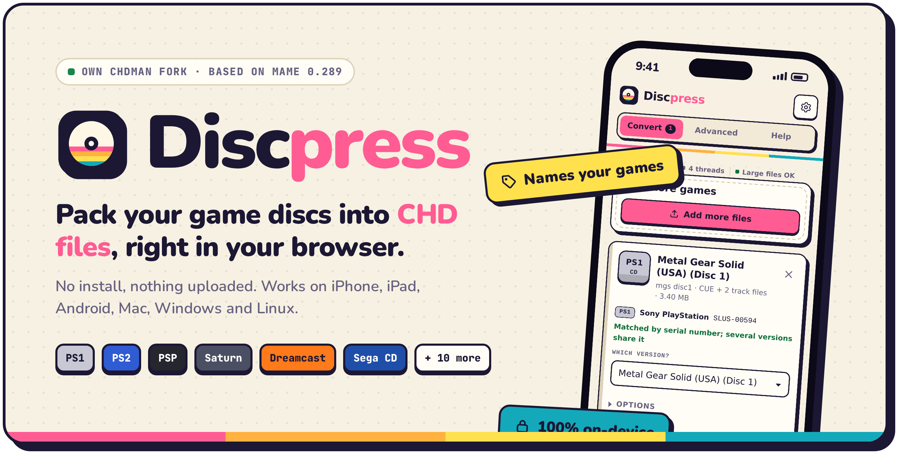
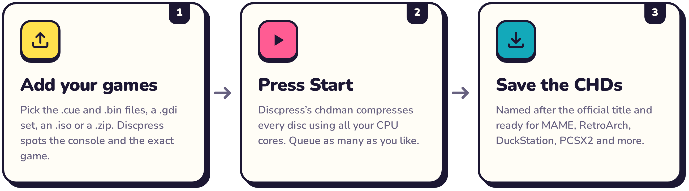
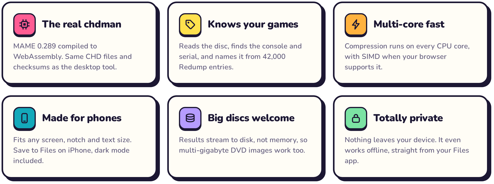
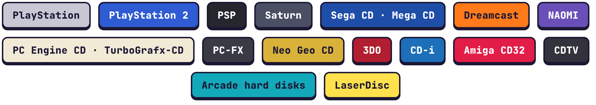
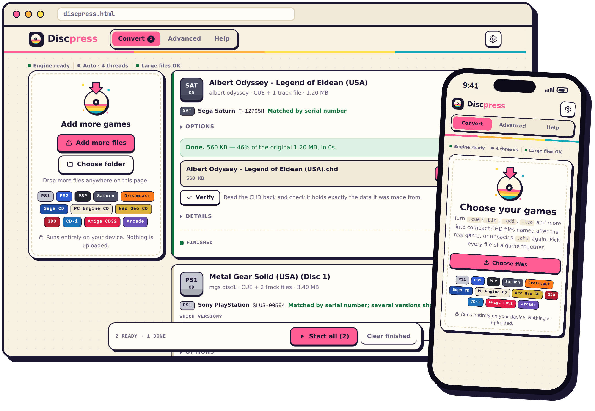

<p align="center">
  <picture>
    <source media="(max-width: 600px) and (prefers-color-scheme: dark)" srcset="docs/brand/hero-mobile-dark.png">
    <source media="(max-width: 600px)" srcset="docs/brand/hero-mobile-light.png">
    <source media="(prefers-color-scheme: dark)" srcset="docs/brand/hero-dark.png">
    
  </picture>
</p>

<p align="center">
  <a href="https://github.com/PowerBeef/discpress/releases/latest/download/discpress.html">
    <picture>
      <source media="(prefers-color-scheme: dark)" srcset="docs/brand/download-dark.png">
      
    </picture>
  </a>
</p>

<p align="center">
  <b>Free and open source</b> &nbsp;·&nbsp; <b>No install</b> &nbsp;·&nbsp; <b>Nothing uploaded</b> &nbsp;·&nbsp; <b>Phone and desktop</b>
  <br><br>
  <a href="#how-it-works">How it works</a> &nbsp;·&nbsp;
  <a href="#features">Features</a> &nbsp;·&nbsp;
  <a href="#supported-systems">Systems</a> &nbsp;·&nbsp;
  <a href="#get-started">Get started</a> &nbsp;·&nbsp;
  <a href="#faq">FAQ</a> &nbsp;·&nbsp;
  <a href="#build-it-yourself">Build it yourself</a>
</p>


## What is Discpress?

A single PlayStation or Saturn game can be a dozen `.bin` files plus a `.cue`. **CHD** packs the whole disc into one compressed file that takes much less space, loses nothing, and loads directly in MAME, RetroArch, DuckStation, PCSX2, PPSSPP, Flycast and more.

The standard tool for making CHDs is **chdman**, a command-line program from the MAME project. **Discpress** puts the real chdman inside a friendly app that runs in your web browser, on your phone or your computer. There's no terminal and nothing to install, and your files never leave your device. It also recognizes your games and names each file after its official title.

## How it works

<p align="center">
  <picture>
    <source media="(max-width: 600px) and (prefers-color-scheme: dark)" srcset="docs/brand/steps-mobile-dark.png">
    <source media="(max-width: 600px)" srcset="docs/brand/steps-mobile-light.png">
    <source media="(prefers-color-scheme: dark)" srcset="docs/brand/steps-dark.png">
    
  </picture>
</p>

## Features

<p align="center">
  <picture>
    <source media="(max-width: 600px) and (prefers-color-scheme: dark)" srcset="docs/brand/features-mobile-dark.png">
    <source media="(max-width: 600px)" srcset="docs/brand/features-mobile-light.png">
    <source media="(prefers-color-scheme: dark)" srcset="docs/brand/features-dark.png">
    
  </picture>
</p>

<details>
<summary><b>Everything it can do</b></summary>
<br>

- **Real chdman output.** chdman from the official MAME 0.289 release, compiled to WebAssembly, makes standard CHD v5 files, byte for byte the same as desktop chdman 0.289 makes on Linux, and with the same checksums as any chdman 0.289.
- **The right command, picked for you:** `createcd`, `createdvd`, `createhd`, `createld`, `extractcd`, `extractdvd`, `extracthd`, `verify` and `info`. The **Advanced** tab gives you every chdman command and option, including `copy`, parent CHDs, `addmeta` and hard disk templates.
- **Game recognition.** Discpress reads the disc's own boot files to find the console and serial number, then looks the game up in a built-in copy of the [Redump](http://redump.org) database (about 42,000 discs). When the size and CRC-32 match, the dump is marked as verified. When several releases share a serial number, you choose which one. Verifying a CHD also compares it with Redump, without extracting it.
- **Official names.** For example `Metal Gear Solid (USA) (Disc 1).chd`. You can also type your own name, turn renaming off, or use **Rename** to fix the name of a CHD you already have.
- **Fast.** Compression is spread over all your CPU cores, with WebAssembly SIMD when your browser supports it.
- **Big files.** Results are written to the browser's private disk storage, so multi-gigabyte DVD images work. On desktop Chrome and Edge, results can go straight into a folder you choose.
- **Made for phones.** It adapts to any screen, notch, rotation and text size, in light or dark mode. On iPhone and iPad, **Save to Files** uses the share sheet.
- **Private and offline.** It's one self-contained HTML file with nothing to load from the internet.

</details>

## Supported systems

<p align="center">
  <picture>
    <source media="(max-width: 600px) and (prefers-color-scheme: dark)" srcset="docs/brand/systems-mobile-dark.png">
    <source media="(max-width: 600px)" srcset="docs/brand/systems-mobile-light.png">
    <source media="(prefers-color-scheme: dark)" srcset="docs/brand/systems-dark.png">
    
  </picture>
</p>

| System | Add these files | Becomes |
|---|---|---|
| PlayStation, Saturn, Sega CD, PC Engine CD, Neo Geo CD, 3DO, CD-i, Amiga CD32, PC-FX | `.cue` + `.bin` (or ECM-packed `.bin.ecm`), or CloneCD `.ccd` + `.img` (+ `.sub`) | CD CHD |
| Dreamcast | `.gdi` + tracks, or Redump `.cue` + `.bin` | CD CHD (GD-ROM detected) |
| PlayStation 2 | DVD games: `.iso`, or compressed `.cso`/`.zso` · CD games: `.cue` + `.bin` | DVD or CD CHD |
| PSP | `.iso`, or compressed `.cso`/`.zso` | DVD CHD |
| Arcade and computer hard disks | `.img`, `.hdd` | Hard disk CHD |
| LaserDisc arcade games | `.avi` | LaserDisc CHD |
| Any of the above | `.chd` | Back to `.cue`/`.bin` (by default the Redump dump's own files), `.gdi` or `.iso` |

## See it in action

<p align="center">
  <picture>
    <source media="(prefers-color-scheme: dark)" srcset="docs/brand/showcase-dark.png">
    
  </picture>
</p>

## Get started

1. **[Download `discpress.html`](https://github.com/PowerBeef/discpress/releases/latest/download/discpress.html).** It's the whole app in one file.
2. **Open it.**
   - **Computer:** double-click it, and it opens in your browser.
   - **Android:** open it with Chrome or another browser.
   - **iPhone and iPad:** save it to the Files app, then open it with an app that can run web pages, such as Sitecase.
3. **Add your games.** Pick every file of a game together (the `.cue` *and* its `.bin` files), or drag them onto the page.
4. **Press Start all**, then **Save** or **Download** each CHD when it's ready. Keep the page open while it works.


## FAQ

<details>
<summary><b>Are my games uploaded anywhere?</b></summary>
<br>
No. Discpress is a single file that runs entirely on your device. It makes no network requests and works in airplane mode.
</details>

<details>
<summary><b>Are the CHDs as good as the ones from desktop chdman?</b></summary>
<br>
Yes. Discpress runs chdman from the official MAME 0.289 release, so the files are standard CHD v5 with the same checksums as desktop chdman 0.289's, and byte for byte the same as chdman 0.289 makes on Linux, CD audio included. (chdman builds for Windows or macOS round the FLAC encoder's floating-point math differently, so their CD-audio bytes can differ from each other's and from Discpress's, never the audio itself.) Its source is in <a href="engine/README.md"><code>engine/</code></a>. The changes let it run in a browser and on several cores, make it faster without changing a byte, and fix chdman 0.289's crashes on bad input. Two opt-in choices change the bytes but not the checksums: the <i>Nearly as small, faster</i> compression and keeping cue sheets in CD CHDs. You can read every change in <a href="engine/mame-0.289.diff"><code>engine/mame-0.289.diff</code></a>.
</details>

<details>
<summary><b>Which browsers work?</b></summary>
<br>

| Browser | Support |
|---|---|
| Safari 16.4+ (iPhone, iPad, Mac) | Full |
| Chrome and Edge 102+ (desktop, Android) | Full, plus saving straight into a folder |
| Firefox 111+ | Full |

Older browsers keep results in memory instead of on disk, which limits how big a disc can be.
</details>

<details>
<summary><b>How big can a disc be?</b></summary>
<br>
Multi-gigabyte DVD images work as long as your device has the free space, because results are written to disk rather than memory. Creating a CHD is CPU-heavy, so expect a few minutes per CD on a computer and longer on a phone. <i>Nearly as small, faster</i> in Options tries each track with only the codec that suits it: about 1.7 times as fast for CDs and 1.4 for DVDs, with files at most 0.3% bigger and the same checksums. <i>Faster to create</i> trades more size for more speed.
</details>

<details>
<summary><b>My game says "not recognized". Is something wrong?</b></summary>
<br>
No. Hacks, translations, homebrew and modified dumps aren't in the Redump database, so they keep their original file name. The conversion works exactly the same. You can also type any name you like in Options.
</details>

<details>
<summary><b>Can I turn a CHD back into a .cue/.bin or .iso?</b></summary>
<br>
Yes. Add the <code>.chd</code> and choose Extract. A CD comes back as its Redump dump: the same cue sheet and <code>.bin</code> files. For discs whose cue sheet holds more than a CHD stores (CATALOG, FLAGS, ISRC, extra indexes: common on Saturn, Sega CD, PC Engine CD, 3DO and CD-i), turn on Settings → *Keep the cue sheet in CD CHDs* before converting, and that sheet comes back too. You can also verify a CHD's checksums, which compares it with Redump too, or view its details.
</details>

<details>
<summary><b>Does Discpress come with any games?</b></summary>
<br>
No. It only converts files you already have. Please convert only discs you own.
</details>

## Build it yourself

The build is fully reproducible: building from a clean checkout gives a byte-identical `dist/discpress.html`.

<details>
<summary><b>Build instructions</b></summary>
<br>

Requirements: [Emscripten](https://emscripten.org/docs/getting_started/downloads.html) 6.0.10, Python 3 and make. The chdman source is in `engine/` (see [`engine/README.md`](engine/README.md)).

```sh
# one-time setup
git clone https://github.com/emscripten-core/emsdk.git ~/emsdk
~/emsdk/emsdk install 6.0.10 && ~/emsdk/emsdk activate 6.0.10

# build
source ~/emsdk/emsdk_env.sh
./build.sh                      # -> dist/discpress.html
```

- If you only change files in `app/`, run `python3 scripts/assemble.py` instead of the full build. Without Emscripten, run `python3 scripts/extract-build.py` once first: it recovers the WebAssembly build from `dist/discpress.html`.
- `tests/` has end-to-end UI tests (Playwright) that check every conversion against native chdman, plus conversion benchmarks. See [`tests/README.md`](tests/README.md).
- To refresh the game database with the latest Redump data, run `./scripts/update-db.sh`, then `python3 scripts/assemble.py`.
- The README graphics are rendered from `scripts/brand/brand.html` with `python3 scripts/brand/render.py` (needs Playwright).
- Pushing a tag like `v1.0.0`, or running **Actions → Release → Run workflow**, publishes a GitHub release with `discpress.html` attached (see `.github/workflows/release.yml`). Release notes come from `.github/release-notes/<tag>.md` when that file exists.

</details>

<details>
<summary><b>Repository layout</b></summary>
<br>

| Path | What it is |
|---|---|
| `app/` | The web app: page, styles, UI, game identification, and the Web Worker that runs chdman |
| `wasm/` | WebAssembly build: Makefile, link flags, the MAME patch, the parallel-compression helper, and a small SDL stub |
| `db/` | Game database (`db.json.gz`) and the script that builds it from libretro-database |
| `scripts/` | Fetch MAME, update the database, assemble the single HTML file, and render the brand graphics |
| `dist/` | The ready-to-use `discpress.html` |
| `docs/` | README graphics and screenshots |

</details>

<details>
<summary><b>How it works inside</b></summary>
<br>

- **File access.** A custom Emscripten file system reads your files directly (no copy into memory) and writes results to the browser's private storage (OPFS), to a folder, or to memory.
- **Multi-core compression.** Helper workers compress hunks in parallel. chdman's main loop gets a small hook and yields with Asyncify while the helpers work.
- **iOS web views.** When a worker can't read the picked files (inside some file-viewer apps), the page streams them to the worker in chunks instead.
- **Game identification.** It reads boot headers (IP.BIN, SYSTEM.CNF, PARAM.SFO, IPL.TXT and others) through ISO 9660, including inside existing CHDs, then matches the serial number, or the size and CRC-32, against the database.

</details>

## Credits and license

Discpress is released under the [BSD 3-Clause license](LICENSE). It is built on **chdman** and MAME's `lib/util` (BSD 3-Clause, © Aaron Giles, R. Belmont and the MAMEdev team), with zlib, LZMA SDK, FLAC, Zstandard, utf8proc, Expat and a few smaller libraries. Game data comes from [Redump](http://redump.org) via [libretro-database](https://github.com/libretro/libretro-database). See [THIRD_PARTY_NOTICES.md](THIRD_PARTY_NOTICES.md) for the full list.

Discpress is not affiliated with the MAME team, Redump or libretro.

<br>
<p align="center">
  
  <br><br>
  
  <br>
  <sub><b>Discpress</b> · made for everyone with a shelf full of old discs</sub>
</p>
