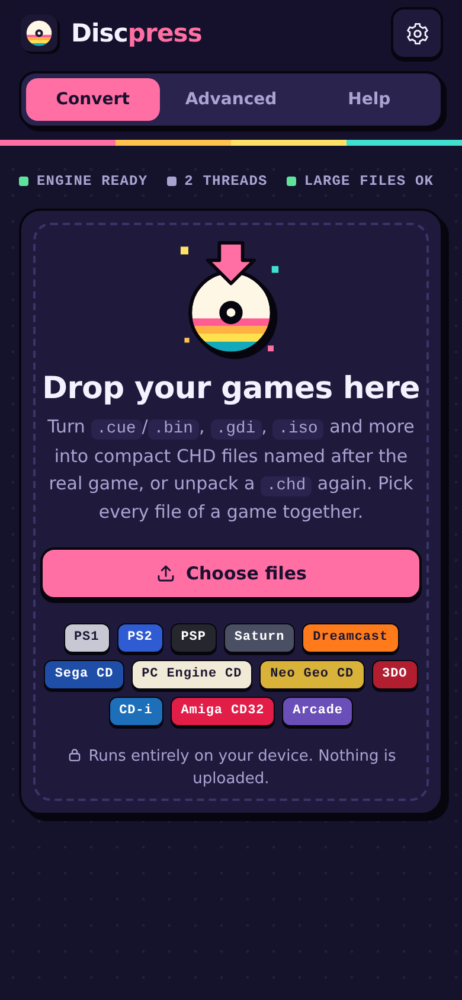
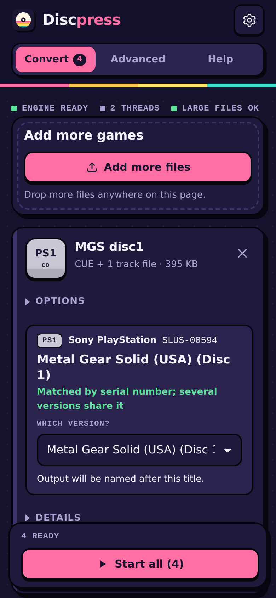
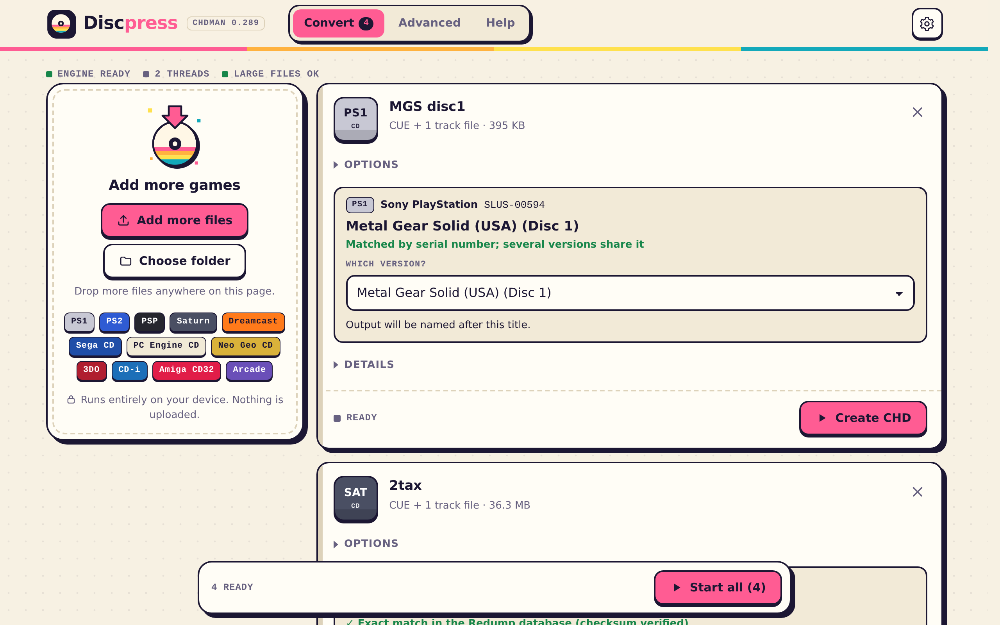

# Discpress

**MAME's chdman in a single HTML file.** Convert disc images to CHD (and back) right in your browser, on iPhone, iPad, Android, Mac, Windows or Linux. Nothing to install and nothing uploaded.

<p align="center">
  
  &nbsp;
  
</p>
<p align="center">
  
</p>

## Use it

1. Download [`dist/discpress.html`](dist/discpress.html) (on GitHub: open it, then use the download button).
2. Open it in any modern browser. It works offline, straight from your Files app, Downloads folder or desktop.
3. Add your game files (`.cue` + `.bin`, `.gdi` + tracks, `.iso`, `.chd`…), then press **Start all**.

## Features

- **The real chdman.** MAME 0.289's chdman compiled to WebAssembly, so the output is identical to desktop chdman (same CHD v5 files, same checksums). Works with MAME, RetroArch, DuckStation, PCSX2, PPSSPP, Flycast and other emulators.
- **Picks the right command for you**: `createcd`, `createdvd`, `createhd`, `createld`, `extractcd`/`extractdvd`/`extracthd`, `verify`, `info`. The **Advanced** tab exposes every chdman command and option.
- **Identifies your games.** It detects the console and serial number from the disc itself and looks the game up in a built-in copy of the [Redump](http://redump.org) database (about 42,000 discs). Output files get the official name, for example `Metal Gear Solid (USA) (Disc 1).chd`. When the size and CRC-32 match, the dump is marked as verified.
- **Supported systems:** PlayStation 1/2, PSP, Saturn, Sega CD / Mega CD, Dreamcast (GD-ROM), NAOMI, PC Engine CD, PC-FX, Neo Geo CD, 3DO, CD-i, Amiga CD32/CDTV, arcade hard disks and LaserDiscs.
- **Fast.** Compression is spread over several CPU cores, using WebAssembly SIMD when available.
- **Handles big files.** Results are written to the browser's private disk storage (OPFS), so multi-gigabyte DVD images work. On desktop Chrome and Edge, results can go straight into a folder you choose.
- **Made for phones too.** It adapts to any screen, notch, rotation, text size and dark mode. On iPhone and iPad, **Save to Files** uses the share sheet, which also works inside file-viewer apps.
- **Private.** Everything runs on your device.

## Browser support

| Browser | Notes |
|---|---|
| Safari 16.4+ (iOS, iPadOS, macOS) | Full support |
| Chrome / Edge 102+ (desktop, Android) | Full support, plus saving straight into a folder |
| Firefox 111+ | Full support |

Older browsers fall back to keeping results in memory, which limits the size of the files you can convert.

## Build from source

The HTML file is fully reproducible: building from a clean checkout gives a byte-identical `dist/discpress.html`.

Requirements: [Emscripten](https://emscripten.org/docs/getting_started/downloads.html) 6.0.10, Python 3, make and git.

```sh
# one-time setup
git clone https://github.com/emscripten-core/emsdk.git ~/emsdk
~/emsdk/emsdk install 6.0.10 && ~/emsdk/emsdk activate 6.0.10
./scripts/fetch-mame.sh         # MAME 0.289 source (only what chdman needs) + the browser patch

# build
source ~/emsdk/emsdk_env.sh
./build.sh                      # -> dist/discpress.html
```

If you only change files in `app/`, rerun `python3 scripts/assemble.py` instead of the full build.

To refresh the game database with the latest Redump data, run `./scripts/update-db.sh`, then `python3 scripts/assemble.py`.

### Repository layout

| Path | What it is |
|---|---|
| `app/` | The web app: page, styles, UI, game identification, and the Web Worker that runs chdman |
| `wasm/` | WebAssembly build: Makefile, link flags, the MAME patch, the parallel-compression helper, and a small SDL stub |
| `db/` | Game database (`db.json.gz`) and the script that builds it from libretro-database |
| `scripts/` | Fetch MAME, update the database, and assemble the single HTML file |
| `dist/` | The ready-to-use `discpress.html` |

### How it works

- **File access.** A custom Emscripten file system reads your files directly (no copy into memory) and writes results to OPFS, to a folder, or to memory.
- **Multi-core compression.** Helper workers compress hunks in parallel. chdman's main loop gets a small hook ([`wasm/mame.patch`](wasm/mame.patch)) and yields with Asyncify while the helpers work.
- **iOS web views.** When a worker can't read the picked files (some file-viewer apps), the page streams them to the worker in chunks instead.
- **Game identification.** It reads boot headers (IP.BIN, SYSTEM.CNF, PARAM.SFO, IPL.TXT…) through ISO 9660, including inside existing CHDs, then matches the serial number or the size and CRC-32 against the database.

## License

Discpress is released under the [BSD 3-Clause license](LICENSE). It includes chdman and MAME's `lib/util` (BSD 3-Clause, © Aaron Giles, R. Belmont and the MAMEdev team), plus zlib, LZMA SDK, FLAC, Zstandard, utf8proc and Expat. The game database comes from [libretro-database](https://github.com/libretro/libretro-database) (Redump data). See [THIRD_PARTY_NOTICES.md](THIRD_PARTY_NOTICES.md).

Discpress is not affiliated with the MAME team, Redump or libretro. It does not include any games. Only convert discs you own.
